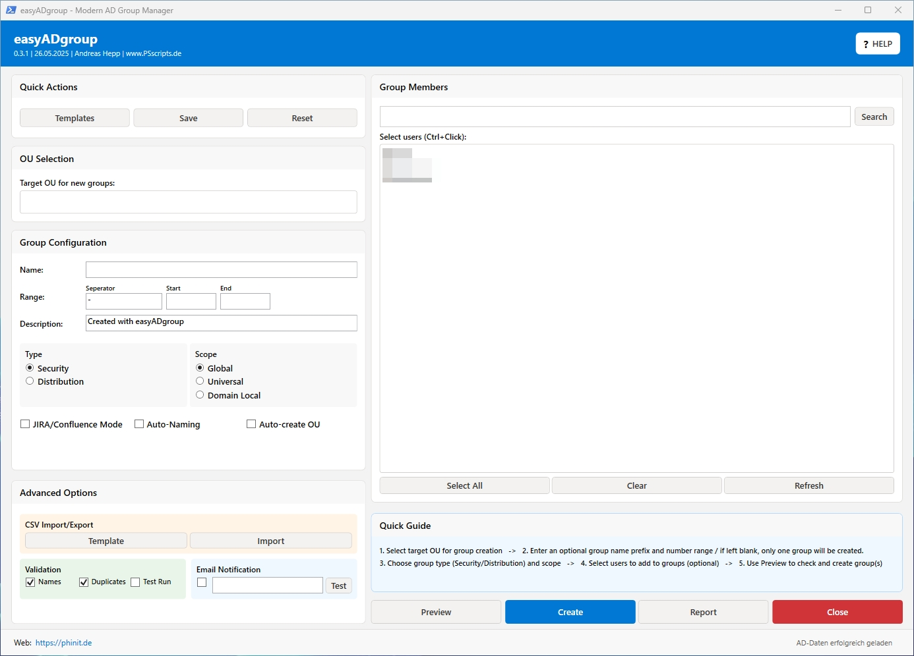

# easyADgroup v0.3.1 - Modern AD Group Manager

Ein modernes PowerShell-Tool mit Windows 11-inspirierter GUI für die einfache Erstellung von Active Directory-Gruppen.



## 🚀 Neue Funktionen in v0.3.1

### 🎨 Modernes Windows 11 Design
- **Fluent Design**: Abgerundete Ecken, moderne Farben und Schatten
- **Responsive Layout**: Anpassbare Fenstergröße mit Mindestabmessungen
- **Intuitive Icons**: Emoji-basierte Icons für bessere Benutzerfreundlichkeit
- **Dunkle Akzente**: Windows 11-konforme Farbpalette (#0078D4, #F3F3F3)

### 📋 Vorlagen-Management
- **Konfigurationen speichern**: Häufig verwendete Einstellungen als Vorlagen speichern
- **Schnelles Laden**: Gespeicherte Vorlagen mit einem Klick laden
- **JSON-Format**: Vorlagen werden im lesbaren JSON-Format gespeichert
- **Automatische Verwaltung**: Vorlagen-Verzeichnis wird automatisch erstellt

### 🔍 Erweiterte Benutzersuche
- **Live-Suche**: Echtzeit-Filterung der Benutzerliste
- **Verzögerte Suche**: Optimierte Performance durch 500ms Verzögerung
- **Mehrfachauswahl**: Erweiterte Auswahloptionen (Alle/Keine)
- **Aktualisierung**: Manuelle Aktualisierung der Benutzerliste

### 📊 CSV Import/Export
- **Bulk-Import**: Massenimport von Gruppen via CSV-Datei
- **Vorlagen-Download**: CSV-Vorlage mit Beispieldaten
- **Validierung**: Automatische Überprüfung der CSV-Daten
- **Vorschau**: Anzeige der zu importierenden Gruppen vor der Erstellung

### ✅ Erweiterte Validierung
- **Duplikat-Prüfung**: Überprüfung auf bereits existierende Gruppen
- **Namens-Validierung**: Prüfung auf ungültige Zeichen und Längen
- **OU-Existenz**: Überprüfung der Ziel-OU vor Gruppenerstellung
- **Batch-Limits**: Schutz vor zu großen Batch-Operationen (max. 1000)

### 🔧 Erweiterte Optionen
- **Testlauf-Modus**: Simulation ohne tatsächliche Änderungen
- **OU Auto-Erstellung**: Automatische Erstellung fehlender OUs
- **Automatische Namenskonvention**: Konfigurierbare Namensvorlagen
- **Fortschrittsanzeige**: Integrierte Fortschrittsbalken

### 📧 E-Mail-Benachrichtigungen
- **Erfolgs-Benachrichtigungen**: E-Mail nach Gruppenerstellung
- **Test-Funktion**: E-Mail-Konfiguration testen
- **Detaillierte Berichte**: Vollständige Informationen über erstellte Gruppen
- **Konfigurierbar**: SMTP-Einstellungen in INI-Datei

### 📈 Berichtswesen
- **Detaillierte Berichte**: Umfassende Dokumentation aller Aktionen
- **Export-Funktion**: Berichte als Textdateien speichern
- **Automatisches Öffnen**: Berichte werden automatisch in Notepad geöffnet
- **Zeitstempel**: Vollständige Nachverfolgbarkeit

## 📋 Systemanforderungen

- **Windows 10/11** (Windows Server 2016+)
- **PowerShell 5.1** oder höher
- **Active Directory PowerShell-Modul**
- **RSAT-Tools** (bei Windows Client)
- **Administratorrechte**

## 🛠️ Installation

1. **Repository klonen oder herunterladen**
```powershell
git clone https://github.com/PS-easyIT/easyADGroups.git
```

2. **Abhängigkeiten installieren**
```powershell
# RSAT-Tools installieren (Windows 10/11)
Get-WindowsCapability -Name RSAT* -Online | Add-WindowsCapability -Online

# Active Directory Modul importieren
Import-Module ActiveDirectory
```

3. **Konfiguration anpassen**
- `easyADGroups.ini` nach Bedarf bearbeiten
- AD-Server und Standard-OUs konfigurieren

4. **Script ausführen**
```powershell
# Als Administrator ausführen
.\easyADGroup_V0.3.1.ps1
```

## ⚙️ Konfiguration

### INI-Datei Abschnitte

#### [General]
- `ScriptVersion`: Aktuelle Version
- `Debug`: Debug-Modus (0/1)
- `Author`: Autor-Information

#### [GUI]
- `HeaderBackColor`: Header-Hintergrundfarbe
- `AppName`: Anwendungsname
- `PrimaryColor`: Primäre Akzentfarbe

#### [AD]
- `ADServer`: Active Directory Server
- `MaxUsersToLoad`: Max. Benutzer beim Laden
- `DefaultGroupOU`: Standard-OU für Gruppen

#### [VALIDATION]
- `ValidateGroupNames`: Namensvalidierung aktivieren
- `CheckDuplicates`: Duplikat-Prüfung aktivieren
- `MaxGroupsPerBatch`: Max. Gruppen pro Vorgang

#### [EMAIL]
- `SMTPServer`: E-Mail-Server
- `FromEmail`: Absender-Adresse
- `EmailSubjectPrefix`: Betreff-Präfix

## 🎯 Verwendung

### Einzelne Gruppe erstellen
1. **Gruppenname** eingeben
2. **OU auswählen** aus der Dropdown-Liste
3. **Gruppentyp** und **Geltungsbereich** wählen
4. Optional: **Benutzer** aus der Liste auswählen
5. **Vorschau** anzeigen oder direkt **Erstellen**

### Mehrere Gruppen (Nummernbereich)
1. **Basis-Gruppenname** eingeben
2. **Separator** definieren (z.B. "-")
3. **Start-** und **Endnummer** eingeben
4. Weitere Schritte wie bei Einzelgruppe

### JIRA/Confluence Gruppensets
1. **Basis-Gruppenname** eingeben
2. **Spezial-Modus** aktivieren
3. Suffixe werden automatisch aus INI-Datei geladen
4. Erstellt automatisch Gruppen mit RW, R, ADM Suffixen

### CSV-Import
1. **CSV-Vorlage herunterladen**
2. Datei mit Gruppendaten befüllen
3. **CSV importieren** und Vorschau prüfen
4. Import bestätigen

### Vorlagen verwenden
1. **Konfiguration** nach Wunsch einstellen
2. **Als Vorlage speichern** mit Namen
3. **Vorlage laden** bei Bedarf

## 🔍 Zusätzliche Funktionen

### Erweiterte Suchfunktionen
- **Live-Suche**: Benutzer in Echtzeit filtern
- **Wildcard-Suche**: Unterstützung für Platzhalter
- **Mehrfachauswahl**: Strg+Klick für mehrere Benutzer

### Validierung und Sicherheit
- **Duplikat-Erkennung**: Verhindert doppelte Gruppen
- **Namens-Validierung**: Prüft auf ungültige Zeichen
- **Testlauf-Modus**: Simulation ohne Änderungen
- **Batch-Limits**: Schutz vor Überlastung

### Berichtswesen und Logging
- **Detailliertes Logging**: Alle Aktionen werden protokolliert
- **Exportierbare Berichte**: Dokumentation für Compliance
- **Fehler-Tracking**: Vollständige Fehlerbehandlung
- **Zeitstempel**: Nachverfolgbare Aktionen

## 🚀 Mögliche Erweiterungen

### Geplante Funktionen
1. **PowerShell 7 Unterstützung**
   - Modernere PowerShell-Features nutzen
   - Bessere Performance und Kompatibilität

2. **Azure AD Integration**
   - Hybrid-Umgebungen unterstützen
   - Cloud-Gruppen verwalten

3. **Erweiterte Berechtigungen**
   - Granulare Rechteverwaltung
   - Delegierte Administration

4. **Automatisierung**
   - Geplante Gruppenoperationen
   - Workflow-Integration

5. **Erweiterte Berichtsfunktionen**
   - Dashboard mit Statistiken
   - Export nach Excel/PDF
   - Grafische Auswertungen

6. **Multi-Domain Support**
   - Mehrere AD-Domänen verwalten
   - Cross-Domain Operationen

7. **Plugin-System**
   - Erweiterbare Architektur
   - Custom-Funktionen hinzufügen

8. **REST API**
   - Programmatische Schnittstelle
   - Integration in andere Tools

9. **Erweiterte GUI-Features**
   - Drag & Drop Funktionalität
   - Kontextmenüs
   - Keyboard-Shortcuts

10. **Backup/Restore**
    - Gruppen-Konfigurationen sichern
    - Rollback-Funktionalität

## 📝 Changelog

### v0.3.1 (16.03.2025)
- ✨ Modernes Windows 11 Design
- 📋 Vorlagen-Management System
- 🔍 Erweiterte Benutzersuche mit Live-Filter
- 📊 CSV Import/Export Funktionalität
- ✅ Erweiterte Validierung und Duplikat-Prüfung
- 📧 E-Mail-Benachrichtigungen
- 📈 Detailliertes Berichtswesen
- 🔧 Testlauf-Modus und OU Auto-Erstellung
- ⚡ Performance-Optimierungen
- 🛡️ Verbesserte Fehlerbehandlung

### v0.2.8 (Vorherige Version)
- Basis-Funktionalität für AD-Gruppenerstellung
- Einfache WPF-GUI
- JIRA/Confluence Spezial-Modus
- Grundlegende Validierung

## 🤝 Beitragen

Beiträge sind willkommen! Bitte:

1. **Fork** des Repositories erstellen
2. **Feature-Branch** erstellen (`git checkout -b feature/AmazingFeature`)
3. **Änderungen committen** (`git commit -m 'Add some AmazingFeature'`)
4. **Branch pushen** (`git push origin feature/AmazingFeature`)
5. **Pull Request** erstellen

## 📄 Lizenz

Dieses Projekt steht unter der MIT-Lizenz. Siehe `LICENSE` Datei für Details.

## 👨‍💻 Autor

**Andreas Hepp**
- Website: [https://phinit.de](https://phinit.de)
- GitHub: [@PS-easyIT](https://github.com/PS-easyIT)

## 🙏 Danksagungen

- Microsoft für PowerShell und Active Directory Module
- Community für Feedback und Verbesserungsvorschläge
- Beta-Tester für ausführliche Tests

## 📞 Support

Bei Fragen oder Problemen:

1. **GitHub Issues** für Bug-Reports und Feature-Requests
2. **Website** [https://phinit.de](https://phinit.de) für weitere Tools
3. **E-Mail** für direkte Anfragen

---

**⭐ Wenn Ihnen dieses Tool gefällt, geben Sie ihm einen Stern auf GitHub!**
